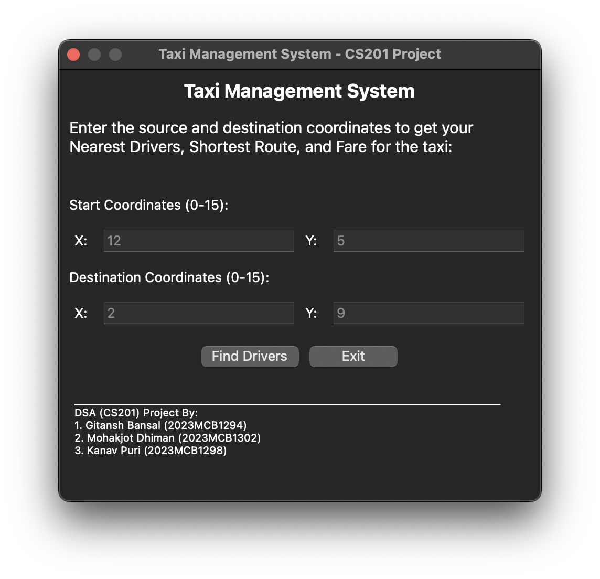
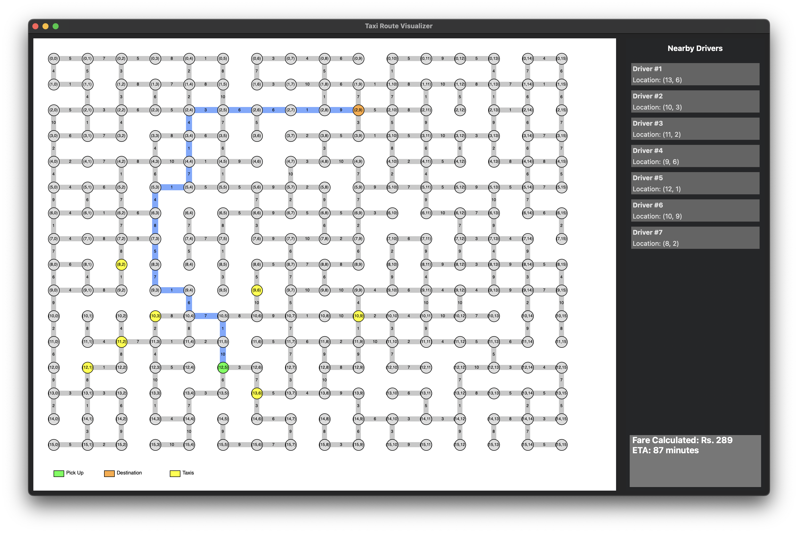
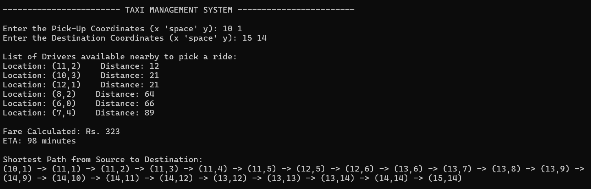

# Taxi Management System

A C++ application simulating a taxi routing and management system, leveraging **van Emde Boas Trees** for efficient driver location management and **Dijkstra's algorithm** for optimal route finding. Developed as a Data Structures and Algorithms (CS201) course project.

---

## Table of Contents
- [Overview](#overview)
- [Features](#features)
- [Screenshots](#screenshots)
- [File Descriptions](#file-descriptions)
- [Dependencies](#dependencies)
- [Build & Installation](#build--installation)
- [Usage](#usage)
- [Contributors](#contributors)
- [Acknowledgments](#acknowledgments)

---

## Overview
This project demonstrates the practical application of advanced data structures and algorithms in a real-world scenario. It provides both a **Graphical User Interface (GUI)** and a **console-based** interface for simulating taxi management, including driver discovery, route calculation, and fare estimation.

---

## Features
- **Interactive GUI** for entering pickup and destination locations
- **Real-time route calculation and visualization** (GUI)
- **Nearby driver detection** using van Emde Boas Trees
- **Fare and ETA estimation**
- **Visual representation** of drivers, routes, and locations (GUI)
- **Console mode** for environments without GUI support
- **Configurable parameters** (universe size, search area, file paths)

---

## Screenshots

### Location Input Window
<div align="center">
  
</div>

### Route Visualization Window
<div align="center">
  
</div>

### Console Application
<div align="center">
  
</div>

---

## File Descriptions
- **source/Code_GUI_App.cpp**: Main C++ source for the GUI application (requires wxWidgets)
- **source/Code_Console_App.cpp**: Console-only version of the application
- **data/drivers.txt**: List of driver coordinates (one pair per line, e.g., `3 4`)
- **data/graph.txt**: Edge list for the city graph (format: `from to weight` per line)
- **assets/Screenshots/**: Contains screenshots for documentation

---

## Dependencies
- **C++11** or later
- **wxWidgets 3.0+** (for GUI)
- Standard C++ libraries (STL)

---

## Build & Installation

### wxWidgets Installation
#### Ubuntu/Debian
```bash
sudo apt-get install libwxgtk3.0-dev
```
#### macOS
```bash
brew install wxwidgets
```
#### Windows
Download and install from [wxWidgets Downloads](https://www.wxwidgets.org/downloads/). Ensure `wx-config` is in your PATH or use the appropriate include/link flags for your setup.

### Build Commands
Navigate to the `Taxi_Management_System` directory:

**GUI Application:**
```bash
g++ -std=c++11 source/Code_GUI_App.cpp `wx-config --cxxflags --libs` -o GUI_App
```
**Console Application:**
```bash
g++ -std=c++11 source/Code_Console_App.cpp -o Console_App
```

---

## Usage
1. Ensure `drivers.txt` and `graph.txt` are in the correct directory, or update their paths in the source code (`driver_file`, `graph_file` constants).
2. **Run the application:**
   - **GUI:**
     ```bash
     ./GUI_App
     ```
   - **Console:**
     ```bash
     ./Console_App
     ```
3. **Follow prompts:**
   - Enter pickup and destination coordinates.
   - (GUI) Click "Find Drivers" to view available drivers, shortest route, fare, and ETA.

---

## Contributors
- **Gitansh Bansal** 
- **Mohakjot Dhiman** 
- **Kanav Puri** 

---

## Acknowledgments
This project was developed as part of the Data Structures and Algorithms (CS201) course at IIT Ropar. It demonstrates the integration of advanced data structures and algorithms in a practical application.

---
